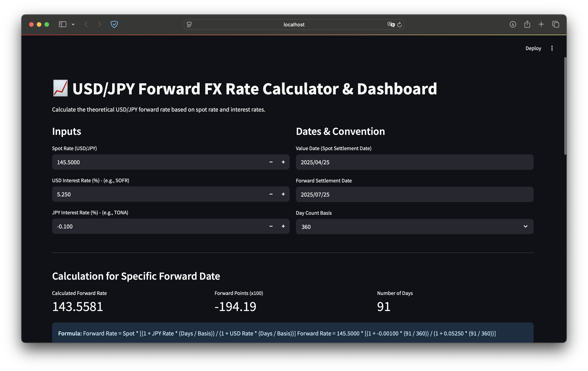

# USD/JPY Forward FX Rate Calculator & Dashboard

[](https://www.python.org/)
[](https://streamlit.io/)
[](https://opensource.org/licenses/MIT)

A web application built with Streamlit to calculate the theoretical USD/JPY forward foreign exchange rate based on the current spot rate and the relevant interest rates for USD and JPY. It also visualizes the forward rate curve across standard tenors.

## Features

*   **Specific Date Calculation:** Calculate the forward rate, forward points (scaled by 100), and the number of days for a specific user-defined value date and forward settlement date.
*   **Formula Display:** Shows the formula used for the calculation with the user's input values.
*   **Forward Curve Visualization:** Generates and displays an interactive forward rate curve using Plotly for standard tenors (1W, 1M, 2M, 3M, 6M, 9M, 1Y, 2Y).
*   **Data Table:** Presents the data points used for the forward curve (Tenor, Settlement Date, Days, Forward Rate, Forward Points) in a clear table format.
*   **User-Friendly Inputs:** Easy-to-use inputs for spot rate, interest rates (USD & JPY), value date, forward date, and day count basis (360/365).
*   **Date Handling:** Uses `datetime` and `dateutil.relativedelta` for robust date calculations, including standard tenor adjustments.

## How it Works

The application calculates the theoretical forward rate using the standard interest rate parity formula (adjusted for day count conventions):

```
Forward Rate = Spot Rate * [(1 + Quote Currency Rate * (Days / Day Basis)) / (1 + Base Currency Rate * (Days / Day Basis))]
```

Where:
*   **Spot Rate:** The current exchange rate (USD/JPY).
*   **Quote Currency Rate:** The interest rate for the quote currency (JPY).
*   **Base Currency Rate:** The interest rate for the base currency (USD).
*   **Days:** The number of days between the value date (spot settlement) and the forward settlement date.
*   **Day Basis:** The day count convention used for annualizing interest rates (typically 360 or 365).

Forward points are calculated as `(Forward Rate - Spot Rate) * 100` (common convention for JPY pairs).

The forward curve is generated by applying this calculation iteratively for standard market tenors relative to the value date.

## Screenshot

<!-- [Insert Screenshot Here] -->
 <!-- Example if you have a screenshot.png -->

## Installation & Setup

1.  **Clone the repository (or download the script):**
    ```bash
    git clone https://github.com/manyan-chan/USD-JPY-Forward-FX-Rate-Calculator-Dashboard.git
    cd USD-JPY-Forward-FX-Rate-Calculator-Dashboard
    ```

2.  **Create and activate a virtual environment (Recommended):**
    ```bash
    python -m venv venv
    # On Windows
    venv\Scripts\activate
    # On macOS/Linux
    source venv/bin/activate
    ```

3.  **Install the required libraries:**
    ```bash
    pip install streamlit pandas plotly python-dateutil
    ```

## Usage

1.  **Run the Streamlit application:**
    ```bash
    streamlit run app.py
    ```

2.  **Open your web browser:** Streamlit will typically open the app automatically, or provide a local URL (like `http://localhost:8501`).

3.  **Interact with the app:**
    *   Adjust the input values (Spot Rate, Interest Rates, Dates, Day Basis) in the sidebar/main panel.
    *   The calculated forward rate for the specific date and the forward curve chart/table will update automatically based on your inputs.

## Dependencies

*   [Streamlit](https://streamlit.io/): For creating the web application interface.
*   [Pandas](https://pandas.pydata.org/): For data manipulation and creating DataFrames.
*   [Plotly](https://plotly.com/python/): For creating interactive charts.
*   [python-dateutil](https://dateutil.readthedocs.io/en/stable/): For robust relative date calculations (e.g., adding months/years).

## Disclaimer

This calculator provides **theoretical** forward rates based on the provided inputs and a standard formula. Actual market forward rates can differ significantly due to various factors including, but not limited to:

*   Market liquidity and depth
*   Bid/ask spreads
*   Counterparty credit risk premiums
*   Transaction costs
*   Specific bank quoting conventions and funding costs
*   Differences between deposit/borrowing rates (like SOFR, TONA, LIBOR, Euribor) used in the market vs. the generic rates input here.

This tool is intended for educational and illustrative purposes only and should not be used for making actual trading decisions. Always consult with a qualified financial professional for trading or investment advice.

## License

This project is licensed under the MIT License - see the [LICENSE](LICENSE) file for details (or specify if different).